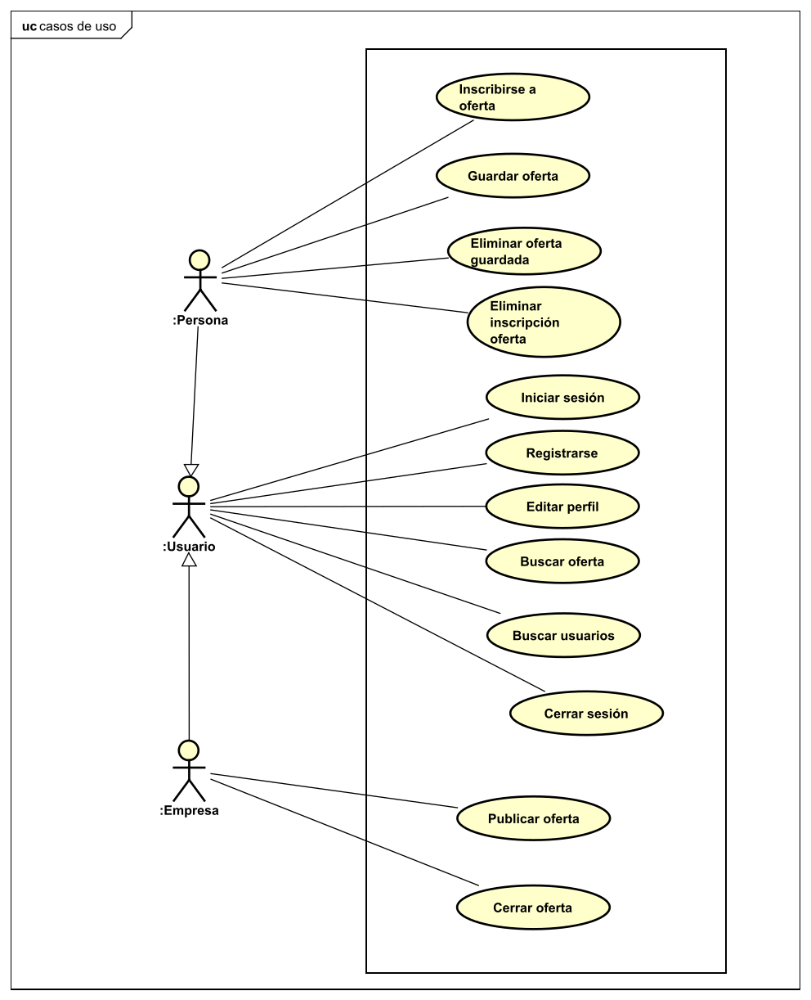
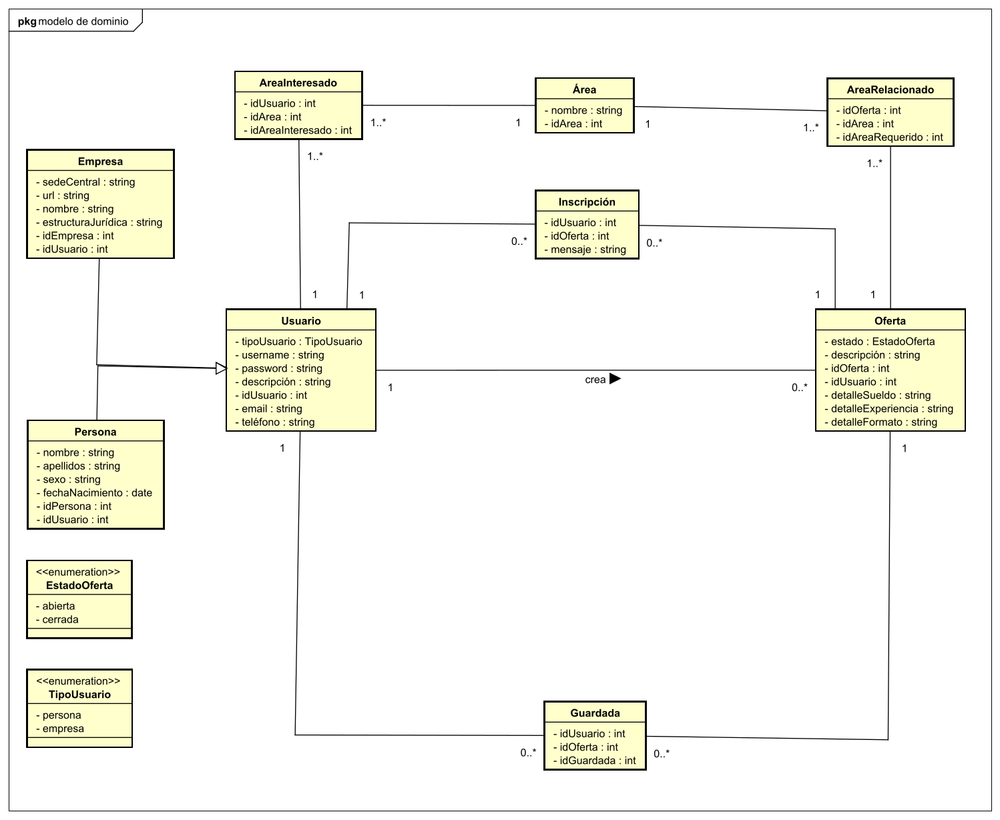
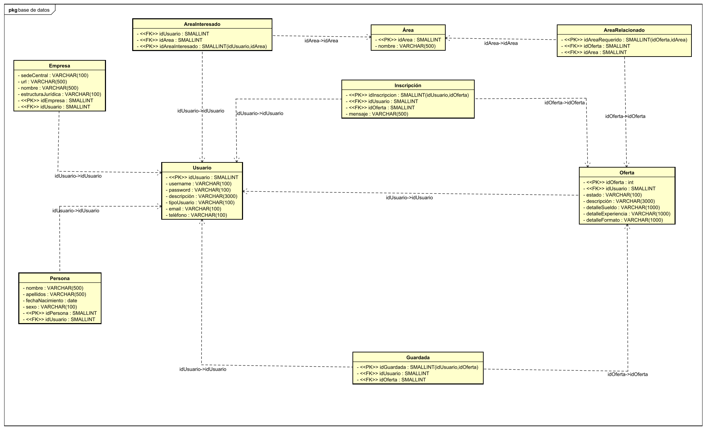
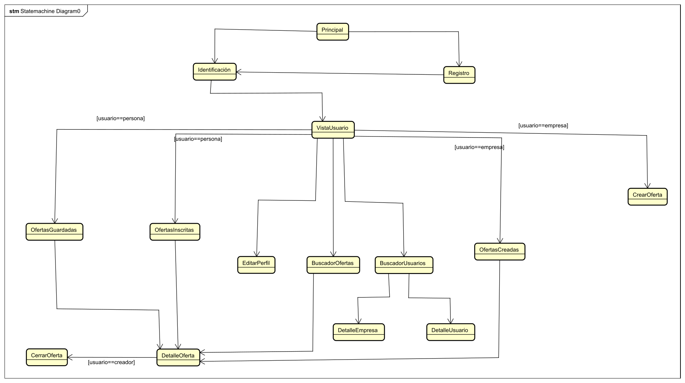

<h1>Documento resumen del proyecto para crear la aplicación "JobsFinder"</h1>

<ol>
<h2><li>Resumen del proyecto</li></h2>

Esta aplicación servirá para publicar ofertas de trabajo por parte de las empresas y para que los usuarios puedan inscribirse a ellas. Los usuarios se podrán registrar como personas o empresas de manera que si se registran como personas se pueden inscribir en ofertas de trabajo y si se registran como empresas pueden publicar ofertas de trabajo. Cada usuario de la aplicación, tanto empresa como persona, podrá añadir una descripción sobre él. Cuando se publique una oferta, se deben incluir detalles sobre ella y la empresa podrá ver las personas que se han inscrito en ella y comunicar a los usuarios si son seleccionados o no. Los usuarios inscritos podrán ver si han sido seleccionados para la oferta. 

<h2><li>Aplicaciones similares</li></h2>

Destacan dos aplicaciones similares en las que se basará este proyecto:

<ul>
<li>Linkedin</li>
<li>Infojobs</li>
</ul>

<h2><li>Tecnologías utilizadas</li></h2>

Las tecnologías utilizadas para el desarrollo de este proyecto son:

<ul>
<li>Frontend: React</li>
<li>Backend: PHP</li>
<li>Base de datos: MySQL</li>
</ul>

<h2><li>Funcionalidad de la aplicación. Casos de uso</li></h2>

A continuación se expone el diagrama de casos de uso de la aplicación:

<h2><li>Diagrama de clases</li></h2>

A continuacion se expone el diagrama de clases de la aplicación:

<h2><li>Diagrama de la base de datos</li></h2>

A continuación se expone el diagrama de la base de datos de la aplicación:

<h2><li>Estructura del backend</li></h2>

La estructura del backend va a consistir en diferentes archivos PHP que funcionan a modo de DAO. Estos archivos se agruparán en carpetas según la tabla de la base de datos sobre la que actúen. 

Los DAO definidos son:

<ul>
<li>UsuarioDAO</li>
<li>PersonaDAO</li>
<li>EmpresaDAO</li>
<li>OfertaDAO</li>
<li>GuardadaDAO</li>
<li>InscritaDAO</li>
</ul>

</ul>
<h2><li>Estructura del frontend</li></h2>
La aplicacion contará con las siguientes vistas:
<ul>
<li>Principal: esta vista funcionará como landing page y mostrará las principales caracteristicas de la aplicación.</li>
<li>Identificación: esta vista contará con un formulario para que el usuario se identifique.</li>
<li>Registro: esta vista contará con un formulario para que el usuario se registre.</li>
<li>VistaUsuario: esta vista aparecerá después de que el usuario se identifique y contendrá un resumen de sus datos.</li>

<li>BuscadorOfertas: en esta vista el usuario podrá realizar una búsqueda para encontrar ofertas y aplicar filtros.</li>
<li>OfertasGuardadas: en esta vista se mostrarán las ofertas que haya guardado la persona.</li>
<li>OfertasInscritas: en esta vista se mostrarán las ofertas en las que se haya inscrito la persona.</li>
<li>DetalleOferta: en esta vista, se podrán ver los detalles de la oferta.</li>

<li>EditarPerfil: en esta vista el usuario podrá editar los datos de su cuenta.</li>
<li>BuscadorUsuarios: en esta vista el usuario podrá realizar una búsqueda para encontrar usuarios y aplicar filtros.</li>
<li>DetalleUsuario: en esta vista, se podrán ver los detalles de un usuario.</li>

<li>PublicarOferta: en esta vista la empresa podrá publicar una oferta rellenando sus detalles en un formulario.</li>
<li>OfertasPublicadas: en esta vista la empresa podrá ver sus ofertas publicadas.</li>
<li>CerrarOferta: en esta vista, la empresa que creó la oferta la podrá cerrar, viendo las personas que se han inscrito a ella.</li>

La navegación entre las diferentes vistas en la siguiente:

</ul>
<h2><li>Bocetos del frontend</li></h2>
Se han realizado bocetos mediante Figma sobre la idea básica de como será la aplicación. Durante el desarrollo del proyecto se han encontrado diferentes ideas y variaciones sobre estos bocetos. Por lo tanto, el resultado final combina los bocetos iniciales y las ideas encontradas durante el desarrollo. Los bocetos se pueden ver en el pdf adjunto.
<h2><li>Detalles de la aplicacion</li></h2>
<ul>
<li>Icono: </li>

<li>Colores:
<ul>
<li>Azul oscuro: #4169E1</li>
<li>Azul claro: #87CEFA</li>
<li>Blanco: #FFFFFF</li>
</ul>
</li>
</ul>
<h2><li>Registro del tiempo</li></h2>

El registro del tiempo es algo fundamental debido a la cantidad de tareas por realizar, además de este proyecto. Por lo tanto se definirá en la siguiente tabla la fecha, la hora de inicio, la hora final, el tiempo utilizado y una descripción de cada tarea realizada y cada trabajo realizado en el proyecto. Además este registro del tiempo sirve para estimar el tiempo de realizacion para trabajos futuros y para controlar que el esfuerzo en este proyecto no exceda los límites aceptables. 

<table>
<tr>
    <th>Fecha</th>
    <th>Hora de inicio</th>
    <th>Hora final</th>
    <th>Tiempo utilizado (en minutos)</th>
    <th>Descripción del trabajo realizado</th>
  </tr>
  <tr>
    <td>Viernes 7 de abril de 2023</td>
    <td>21:20</td>
    <td>22:00</td>
    <td>40</td>
    <td>Realizar primeras partes documento resumen</td>
  </tr>
  <tr>
    <td>Viernes 7 de abril de 2023</td>
    <td>22:55</td>
    <td>23:05</td>
    <td>10</td>
    <td>Realizar diagramas astah</td>
  </tr>
  <tr>
    <td>Lunes 10 de abril de 2023</td>
    <td>21:10</td>
    <td>21:30</td>
    <td>20</td>
    <td>Realizar diagramas astah</td>
  </tr>
  <tr>
    <td>Lunes 10 de abril de 2023</td>
    <td>22:25</td>
    <td>0:00</td>
    <td>95</td>
    <td>Realizar diagramas astah y comenzar bocetos</td>
  </tr>
  <tr>
    <td>Martes 11 de abril de 2023</td>
    <td>9:00</td>
    <td>9:15</td>
    <td>15</td>
    <td>Realizar diagramas astah</td>
  </tr>

  <tr>
    <td>Martes 11 de abril de 2023</td>
    <td>13:30</td>
    <td>14:30</td>
    <td>60</td>
    <td>Script base datos y diagrama base de datos</td>
  </tr>

  <tr>
    <td>Jueves 13 de abril de 2023</td>
    <td>9:10</td>
    <td>10:05</td>
    <td>55</td>
    <td>Parte backend PHP</td>
  </tr>

   <tr>
    <td>Jueves 13 de abril de 2023</td>
    <td>19:15</td>
    <td>20:30</td>
    <td>75</td>
    <td>Bocetos</td>
  </tr>

  <tr>
    <td>Viernes 14 de abril de 2023</td>
    <td>9:00</td>
    <td>9:30</td>
    <td>30</td>
    <td>Parte DAOS PHP</td>
  </tr>

  <tr>
    <td>Viernes 14 de abril de 2023</td>
    <td>17:00</td>
    <td>18:35</td>
    <td>95</td>
    <td>Primeras interfaces React</td>
  </tr>

  <tr>
    <td>Viernes 14 de abril de 2023</td>
    <td>18:55</td>
    <td>21:45</td>
    <td>170</td>
    <td>Primeras interfaces React</td>
  </tr>

  <tr>
    <td>Sabado 15 de abril de 2023</td>
    <td>9:00</td>
    <td>11:25</td>
    <td>145</td>
    <td>Primeras interfaces React</td>
  </tr>

   <tr>
    <td>Sabado 15 de abril de 2023</td>
    <td>13:40</td>
    <td>14:20</td>
    <td>40</td>
    <td>Bocetos</td>
  </tr>

   <tr>
    <td>Sabado 15 de abril de 2023</td>
    <td>17:15</td>
    <td>21:40</td>
    <td>205</td>
    <td>Interfaces React</td>
  </tr>

   <tr>
    <td>Sabado 15 de abril de 2023</td>
    <td>22:30</td>
    <td>23:10</td>
    <td>40</td>
    <td>Interfaces React</td>
  </tr>

   <tr>
    <td>Domingo 16 de abril de 2023</td>
    <td>18:10</td>
    <td>20:50</td>
    <td>160</td>
    <td>Interfaces React</td>
  </tr>

   <tr>
    <td>Domingo 16 de abril de 2023</td>
    <td>22:30</td>
    <td>0:00</td>
    <td>90</td>
    <td>Interfaces React</td>
  </tr>
  
</table>

<strong>Total tiempo empleado: 1345 minutos (22 horas y 25 minutos)</strong>

<h2><li>Organización del proyecto: tablero</li></h2>
Se ha utilizado un tablero en trello para gestionar las tareas a realizar
<h2><li>Resultado final: vídeo youtube y repositorio</li></h2>

Repositorio Github: https://github.com/chemiya/PR-15-JOBSFINDER.git

<h2><li>Conclusiones</li></h2>
He aprendido como desarrollar una aplicación con React para la parte de frontend. He podido observar las ventajas que proporciona este framework sobre sus competidores. Además he podido aplicar los conocimientos adquiridos sobre este framework en relación sobre todo a los hooks. En el backend, he aprendido a utilizar PHP para acceder a la base de datos y para comunicar los datos al frontend. 

</ol>